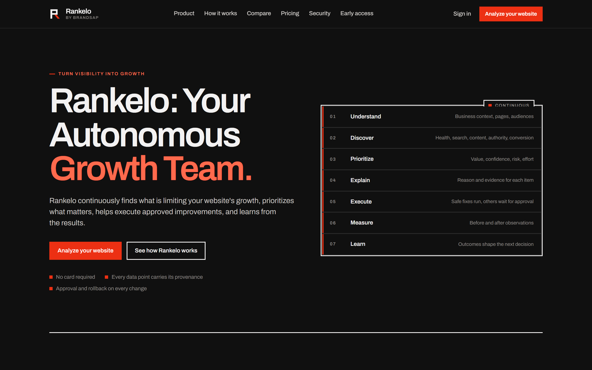
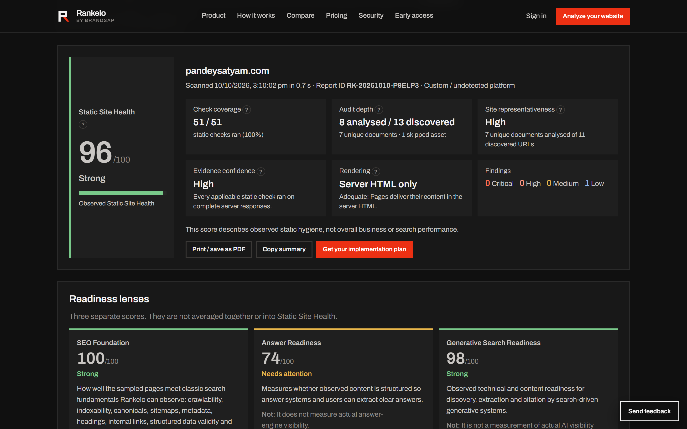
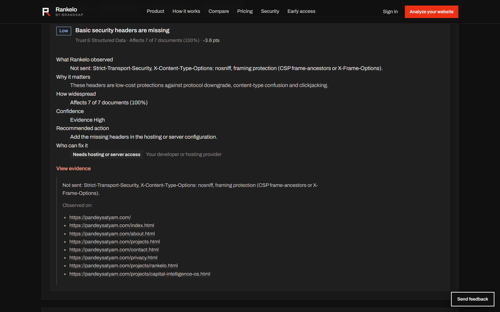
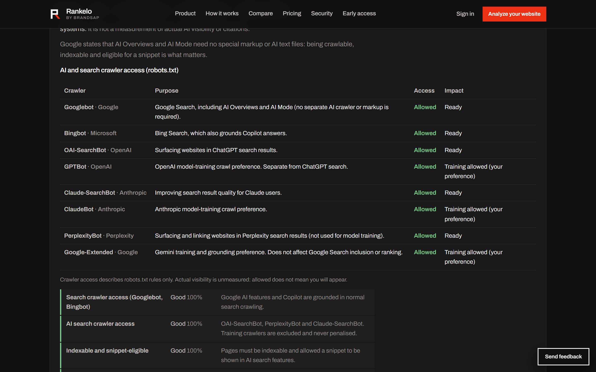

# Rankelo - Your Autonomous Growth Team

**Turn visibility into growth.**

[Rankelo](https://rankelo.brandsap.com/) by [Brandsap](https://brandsap.com/) helps businesses improve SEO, answer-engine readiness and generative-search visibility, then turn prioritized findings into actions. It was created by [Satyam Pandey](https://pandeysatyam.com/), founder of Brandsap.

- Product: <https://rankelo.brandsap.com/>
- Free website analysis: <https://rankelo.brandsap.com/audit.html>
- Category: SEO, AEO and GEO growth platform

**This repository is public documentation, not the product source.** Rankelo is closed-source commercial software. This repository explains how the free audit works and hosts one real, redacted development session.

## What Rankelo does

Rankelo is built around one loop: understand the business, discover what limits its website, prioritize by value and confidence, explain each item with evidence, execute approved work, measure before and after, and learn from the result.

The free website analysis is the public entry point. Enter a URL and Rankelo:

- fetches the page, or a sample of up to 8 pages chosen across the site's sections
- runs 51 deterministic static checks on the HTML, headers, robots.txt and sitemaps it fetched
- reports **Observed Static Site Health** alongside the depth, representativeness and confidence of the audit
- scores three separate readiness lenses: **SEO Foundation**, **Answer Readiness** and **Generative Search Readiness**
- shows which search and AI crawlers your robots.txt allows
- ranks the top priorities, with the evidence behind each finding, the recommended action and who can fix it

The free audit makes no LLM calls and no paid API calls. No signup or card is required. The Rankelo workspace, which adds ongoing monitoring, prioritization and approval-gated execution, is in early access.

## SEO, AEO and GEO

| Lens | What it measures | What it is not |
| --- | --- | --- |
| SEO Foundation | Classic search fundamentals Rankelo can observe: crawlability, indexability, canonicals, sitemaps, metadata, headings, internal links, structured data validity and basic accessibility | A ranking, organic traffic, keyword or backlink measurement |
| Answer Readiness (AEO) | Whether observed content is structured so answer systems and people can extract clear answers | A measurement of actual answer-engine visibility |
| Generative Search Readiness (GEO) | Technical and content readiness for discovery, extraction and citation by search-driven generative systems | A measurement of actual AI visibility or citations |

The three lenses are scored separately. They are never averaged together or into Static Site Health.

## How the audit is reported

| Field | What it tells you |
| --- | --- |
| Observed Static Site Health | A 0 to 100 score of the static defects found in the pages Rankelo inspected. It is not a ranking, traffic, business-quality, Core Web Vitals, backlink or AI-visibility score. |
| Check coverage | How many applicable static checks produced a result, for example 51 / 51. |
| Audit depth | URLs discovered, pages analysed, unique documents, skipped assets and failed pages. |
| Site representativeness | HIGH, MEDIUM or LOW: how well the sample is likely to represent the whole site. It never changes any score. |
| Evidence confidence | How confident Rankelo is that the reported issues exist in what it fetched. |
| Rendering coverage | The free audit reads server HTML only and says so, with an adequacy rating. |

Separating these fields matters. A small site where 7 of 11 URLs were analysed and a large site where 8 of 500+ URLs were analysed can both produce a precise-looking score. Audit depth and representativeness make the difference visible instead of hiding it inside one number.

Sampling is deterministic: the entry page first, then one page per site section in turn, up to 8 pages. Each audit has a fixed request budget (12 requests for a page audit, 40 for a site audit) and a 45 second time limit.

## What Rankelo does not invent

Without real connected data, Rankelo does not report or estimate:

- search rankings or organic traffic
- AI citations or AI visibility
- Core Web Vitals
- backlinks
- conversions or revenue

Where that data is missing, the report says it is unavailable or not connected. It never shows it as 0 or as a guess. Crawler access, for example, describes robots.txt rules only: allowed does not mean a site will appear.

## Crawling and security

The free audit fetches public HTTP and HTTPS targets only. Private networks, metadata addresses, unsafe redirects and credential-bearing URLs are blocked. Rankelo's crawler behaviour is documented in the [crawling policy](https://rankelo.brandsap.com/crawling-policy.html), and its security approach on the [security page](https://rankelo.brandsap.com/security.html).

## Try it

Run a free website analysis at <https://rankelo.brandsap.com/audit.html>. From any report you can print or save it as a PDF, copy a summary, or request an implementation plan from the Rankelo team.

## Development showcase

This repository also hosts [`rankelo_ef_coding_session.md`](./rankelo_ef_coding_session.md): an authentic, redacted transcript of a real Claude Code session from Rankelo's development, originally shared for an [Entrepreneurs First](https://www.joinef.com/) application. In it, the agent builds part of Rankelo's agent-safety layer: the "Guardian" policy engine, a permission-scoped tool registry, and defences against prompt injection from untrusted web content. Nothing in the transcript is invented or rewritten. [`USAGE.md`](./USAGE.md) explains how it was produced and what was redacted.

Rankelo is built with the help of AI coding agents, mainly Claude Code and Codex. These are development tools, not part of how Rankelo runs. The product itself is provider-agnostic: the default LLM route is [OpenRouter](https://openrouter.ai), and OpenAI, Anthropic and Gemini are optional adapters behind an explicit provider-mode switch and a daily spend cap that defaults to zero.

## Repository files

| File | What it is |
| --- | --- |
| [`rankelo_ef_coding_session.md`](./rankelo_ef_coding_session.md) | The redacted development session transcript |
| [`USAGE.md`](./USAGE.md) | How to read the transcript and the rules followed while preparing it |
| [`PRIVACY_POLICY.md`](./PRIVACY_POLICY.md) | A privacy notice for this repository, with a link to the product privacy policy |
| [`LICENSE.md`](./LICENSE.md) | MIT license for the original prose in this repository |
| [`docs/screenshots/`](./docs/screenshots/) | Screenshots of the live product |

## License

The prose written for this repository (this README, `USAGE.md` and `PRIVACY_POLICY.md`) is released under the [MIT License](./LICENSE.md). The session transcript is a historical record shared for transparency, not a reusable code sample. Screenshots show the live product and are not covered by the MIT license.

## Company and contact

Rankelo is a product of [Brandsap](https://brandsap.com/), founded by [Satyam Pandey](https://pandeysatyam.com/) ([LinkedIn](https://www.linkedin.com/in/pandeysatyam/)). Read the [Rankelo case study](https://pandeysatyam.com/projects/rankelo.html).

Brandsap, [contact@brandsap.com](mailto:contact@brandsap.com), Nagpur, Maharashtra, India.
